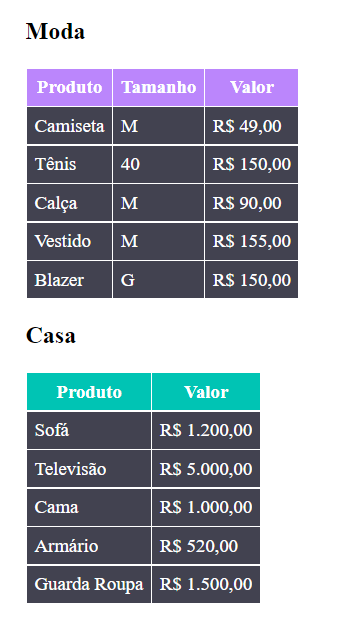

# Tabela-Estilizada-HTML-CSS-Basico

## Criando tabela simples com HTML e CSS seguindo as seguintes regras:

1-  Cor de fundo do cabeçalho moda - #BB86FC 
2- Cor de fundo do cabeçalho casa - #00C4B4 
3- Cor de fundo dos valores da tabela - #424250 
4- Não poder estilizar as tags HTML, sendo orientada a utilização de classes 

 
[]
 
 

## Tecnologias utilizadas:
- HTML
- CSS
